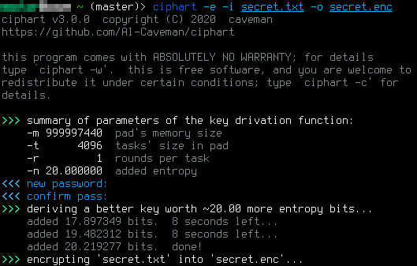
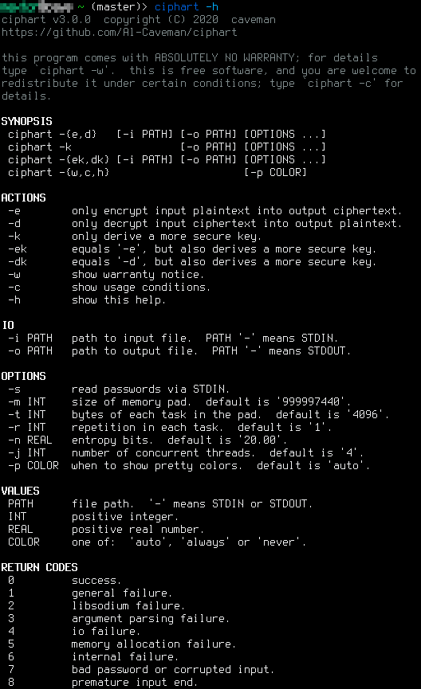

# intro

`ciphart` is a neat file encryption/decryption tool with these features:

- the only file encryption/decryption tool that presents to you parameters
  of the key derivation function (KDF)by means of equivalency to entropy
  bits added to your password!  this is a neat way to interpret KDF's
  parameters.  other KDF's just give you some complexity parameters, and
  expect you to set it as high as you can suffer, without giving you any
  clue of how much security do you gain (in the unit of entropy bits added
  to your password).
- uses a powerful algorithm, xchacha20, as implemented by `libsodium`; a
  modern crypto library.  not much apps support xchacha20 as it is
  relatively new.
- simple api that makes it easy to call it with other apps.  e.g. passwords
  and plaintext data can be both fed via STDIN, something you cannot do
  with some apps, such as `scrypt`.
- only `472` lines of code!  so less things to go wrong, and easy to audit.
- looks _beautiful_!  it is _the_ most beautiful crypto app!

    

    

# how entropy is calculated?

[the _idea_ is explained
here](https://crypto.stackexchange.com/questions/85676/how-to-estimate-the-maximum-computational-cost-bound-for-key-derivation-function).
for more info, you may read the code (it's small), or ask me by submitting
an issue.

# how to utter `ciphart`?

two options:

- `cef art`.
- `sai fart`.
